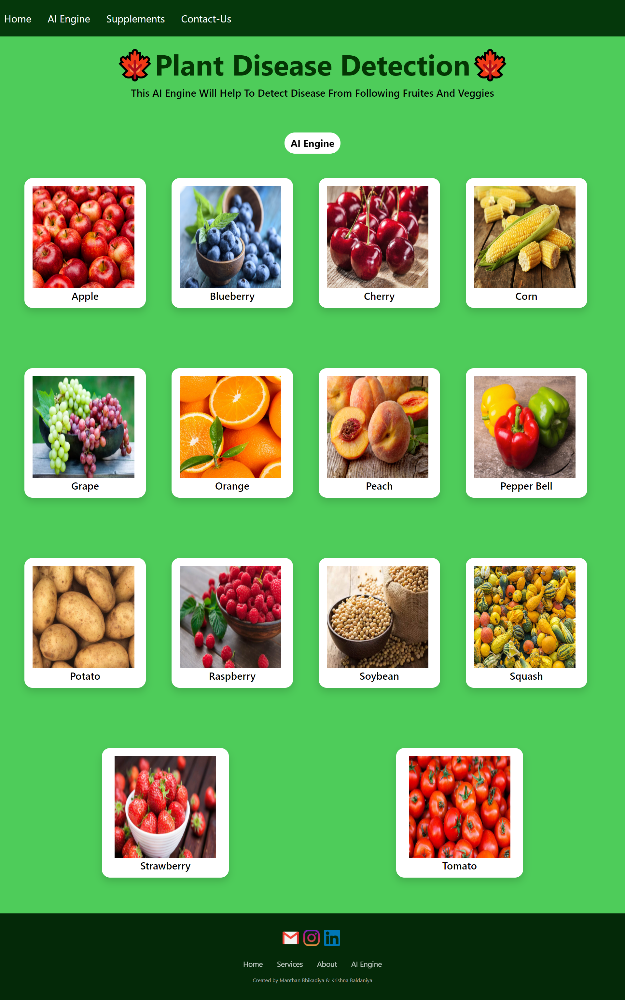
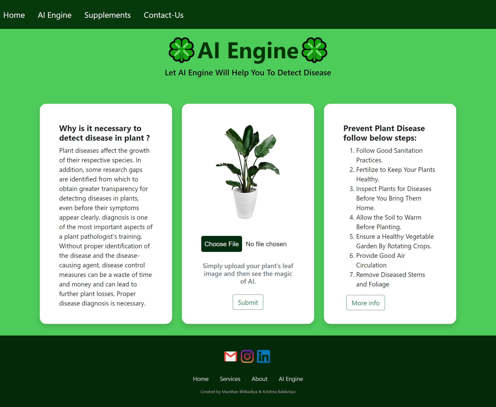
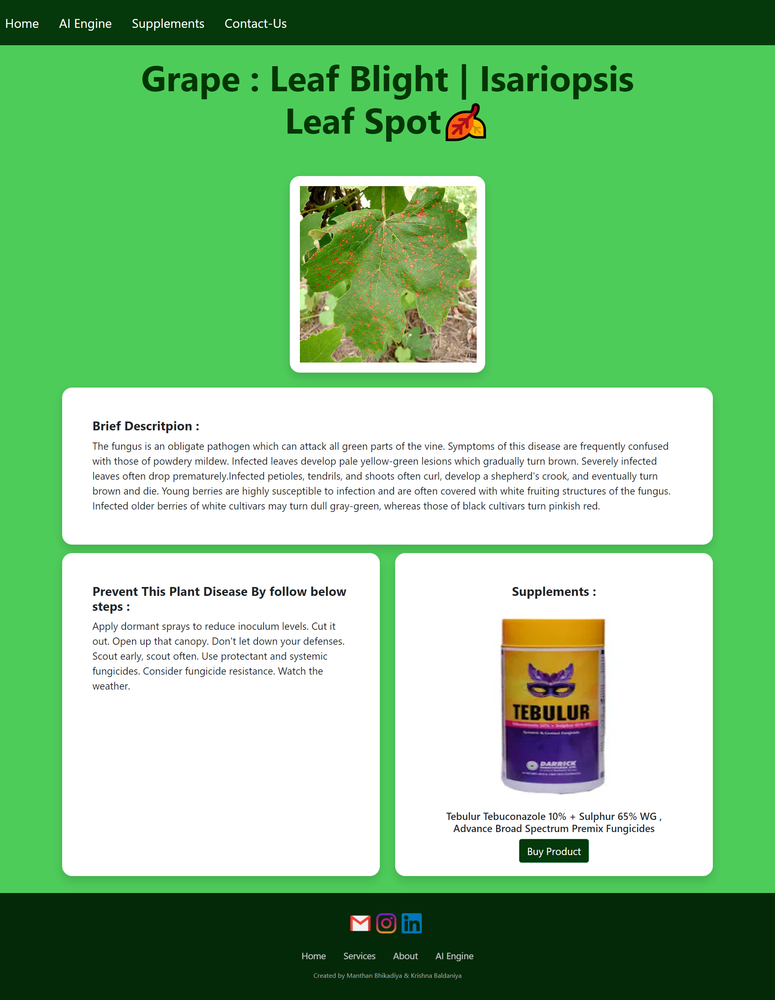
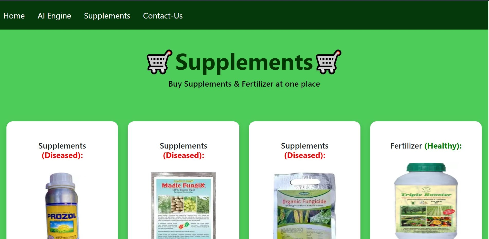

# 🌱 Plant Disease Detection AI Engine

An intelligent plant disease diagnostic system built with **PyTorch** and deployed via a modern **Flask Web Application**. The deep learning model utilizes a **ResNet-34** convolutional neural network with transfer learning, achieving **99.89% validation accuracy** across 38 distinct plant disease classes.

---

## 🚀 Key Features

- **High-Accuracy CNN**: Fine-tuned ResNet-34 architecture achieving **99.89% validation accuracy** (loss: `0.0041`).
- **38 Disease & Healthy Classes**: Covers apple, blueberry, cherry, corn, grape, orange, peach, pepper, potato, raspberry, soybean, squash, strawberry, and tomato.
- **GPU-Accelerated Training Engine**: High-throughput training pipeline in PyTorch with CUDA acceleration, mixed precision support, and real-time GPU telemetry.
- **Interactive Flask Web Application**: Clean UI to upload leaf photos, inspect disease diagnosis, review symptoms/causes, and explore recommended supplements/fertilizers.

---

## 🛠️ Tech Stack & Model Specifications

| Component | Specification |
| :--- | :--- |
| **Architecture** | ResNet-34 (Transfer Learning from ImageNet) |
| **Framework** | PyTorch & Torchvision |
| **Web Framework** | Flask, HTML5, CSS3, JavaScript |
| **Dataset** | PlantVillage Dataset (70,295 Train images, 17,572 Valid images) |
| **Classes** | 39 Model Classes (38 Plant Conditions + Background) |
| **Validation Accuracy** | **99.89%** |
| **Validation Loss** | **0.0041** |
| **Hardware** | Optimized for NVIDIA CUDA GPUs (e.g., GTX 1650 / RTX series) |

---

## ⚡ Quick Start: Running the Web App

### 1. Clone & Setup Environment
```bash
git clone https://github.com/suvo1119/Plant-Disease-Detection.git
cd Plant-Disease-Detection
```

### 2. Install Dependencies
```bash
pip install -r requirements.txt
```

### 3. Run the Flask Web Application
```bash
cd "Flask Deployed App"
python app.py
```
Open your browser and navigate to: **`http://127.0.0.1:5000`**

---

## 🔬 Training the Model (GPU-Accelerated)

To re-train or fine-tune the model on your dataset:

### Full Training Run (NVIDIA GPU):
```bash
python train_model.py --epochs 5 --batch-size 32
```

### Fast Verification Mode (10% Subset):
```bash
python train_model.py --fast --epochs 1
```

### CLI Arguments:
- `--epochs <N>` : Number of epochs (default: `5`).
- `--batch-size <N>` : Batch size, tuned for 4GB+ VRAM (default: `32`).
- `--lr <LR>` : Initial learning rate (default: `1e-4`).
- `--fast` : Subsamples 10% of data for rapid validation cycles.
- `--workers <N>` : DataLoader worker count (default: `0` for optimal Windows GPU streaming).
- `--save-path <path>` : Destination file for trained weights (default: `Flask Deployed App/plant_disease_model_1_latest.pt`).

---

## 📁 Project Structure

```text
Plant-Disease-Detection/
├── Flask Deployed App/
│   ├── app.py                         # Main Flask application
│   ├── CNN.py                         # ResNet-34 model definition & class mapping
│   ├── plant_disease_model_1_latest.pt # Trained model weights (99.89% accuracy)
│   ├── disease_info.csv               # Disease descriptions & prevention steps
│   ├── supplement_info.csv            # Fertilizer & supplement recommendations
│   ├── static/                        # CSS styles, images, uploads
│   └── templates/                     # Jinja2 HTML templates
├── test_images/                       # Sample leaf photos for testing
├── demo_images/                       # UI screenshots
├── Model/                             # Model documentation & architecture
├── train_model.py                     # GPU training engine with real-time telemetry
├── requirements.txt                   # Project Python dependencies
├── .gitignore                         # Git ignore configurations
└── README.md                          # Project documentation
```

---

## 🧪 Testing with Sample Images

If you don't have leaf photos on hand, you can test the application using images in `test_images/`:
- `test_images/Apple_scab.JPG`
- `test_images/apple_black_rot.JPG`
- `test_images/corn_common_rust.JPG`
- `test_images/grape_black_rot.JPG`
- `test_images/tomato_leaf_mold.JPG`
- *... and 39+ other categorized sample leaves.*

---

## 🌟 Visual Preview

#### Main Home Page


#### AI Diagnostic Engine


#### Diagnostic Results & Recommended Actions


#### Supplements & Fertilizer Store

