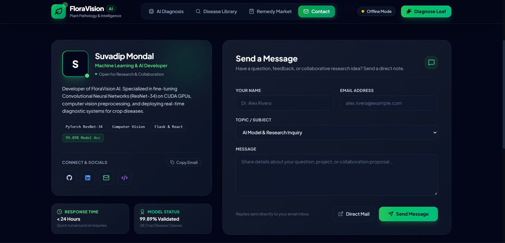

# 🌱 FloraVision AI — Plant Disease Detection Engine

[](https://pytorch.org/)
[](https://react.dev/)
[](https://www.typescriptlang.org/)
[](https://flask.palletsprojects.com/)
[](https://tailwindcss.com/)
[](https://github.com/suvo1119/Plant-Disease-Detection)

An intelligent plant pathology diagnostic system built with **PyTorch** and deployed via a modern **React 19 + Flask Full-Stack Architecture**. The deep learning engine leverages a fine-tuned **ResNet-34** convolutional neural network with transfer learning, achieving **99.89% validation accuracy** across 38 distinct plant disease classes.

---

## 🚀 Key Features

- **🎯 High-Accuracy CNN Engine**: Fine-tuned ResNet-34 architecture achieving **99.89% validation accuracy** (loss: `0.0041`) trained on CUDA GPUs.
- **🌿 39 Classification Categories**: Identifies healthy leaves and pathological conditions across 14 crop families including Apple, Blueberry, Cherry, Corn, Grape, Orange, Peach, Pepper Bell, Potato, Raspberry, Soybean, Squash, Strawberry, and Tomato.
- **⚡ Dual Web Stack**:
  - **Modern Single-Page App (`frontend/`)**: React 19, TypeScript, Vite, Tailwind CSS v4, and Framer Motion glassmorphic UI.
  - **Flask Backend API (`Flask Deployed App/`)**: High-throughput REST API and Jinja2 server-rendered web app.
- **📷 Smart EXIF Preprocessing**: Auto-rotates uploaded leaf photos using EXIF orientation tags, standardizes image tensors, and provides real-time confidence telemetry.
- **🛒 Remedy & Supplement Market**: Recommends targeted fungicides, bactericides, and plant bio-stimulants tailored to diagnosed crop infections.
- **👤 Creator Showcase & Contact Hub**: Dedicated interactive contact view connected with developer socials, direct mailing, and project repository access.

---

## 🛠️ Tech Stack & Model Specifications

| Component | Specification |
| :--- | :--- |
| **Model Architecture** | ResNet-34 (Transfer Learning from ImageNet) |
| **Deep Learning Framework** | PyTorch & Torchvision |
| **Validation Accuracy** | **99.89%** |
| **Validation Loss** | **0.0041** |
| **Dataset** | PlantVillage Dataset (70,295 Training images, 17,572 Validation images) |
| **Supported Classes** | 39 Classes (38 Plant Disease & Healthy Conditions + Background) |
| **Frontend Technologies** | React 19, TypeScript, Vite, Tailwind CSS v4, Lucide Icons, Framer Motion |
| **Backend Technologies** | Python 3.x, Flask, Pillow, NumPy, Pandas, PyTorch |
| **Hardware Optimization** | NVIDIA CUDA GPU acceleration (GTX / RTX series support) |

---

## ⚡ Quick Start Guide

### 1. Clone the Repository
```bash
git clone https://github.com/suvo1119/Plant-Disease-Detection.git
cd Plant-Disease-Detection
```

### 2. Set Up Python Backend & Dependencies
```bash
# Install Python packages
pip install -r requirements.txt

# Launch the Flask application
cd "Flask Deployed App"
python app.py
```
Open your browser and navigate to: **`http://127.0.0.1:5000`**

### 3. Run the Modern React Frontend (Optional for Development)
```bash
cd frontend
npm install
npm run dev
```
For production build serving:
```bash
npm run build
```
*(The Vite build automatically outputs assets directly into `Flask Deployed App/dist/` for seamless Flask serving).*

---

## 🔬 Training Pipeline (GPU-Accelerated)

To re-train or fine-tune the model on your custom crop dataset:

### Full Training Run (NVIDIA GPU):
```bash
python train_model.py --epochs 5 --batch-size 32
```

### Fast Verification Mode (10% Data Sample):
```bash
python train_model.py --fast --epochs 1
```

### CLI Command Arguments:
- `--epochs <N>` : Total number of training epochs (default: `5`).
- `--batch-size <N>` : Batch size optimized for VRAM (default: `32`).
- `--lr <LR>` : Initial learning rate (default: `1e-4`).
- `--fast` : Subsamples 10% of dataset for rapid validation cycles.
- `--workers <N>` : DataLoader worker count (default: `0` for optimal Windows GPU streaming).
- `--save-path <path>` : Destination path for trained model weights (default: `Flask Deployed App/plant_disease_model_1_latest.pt`).

---

## 📁 Project Directory Structure

```text
Plant-Disease-Detection/
├── Flask Deployed App/                # Python Flask Backend & Deployment
│   ├── app.py                         # Main Flask REST server & template routes
│   ├── CNN.py                         # PyTorch ResNet-34 model architecture definition
│   ├── plant_disease_model_1_latest.pt # Pretrained PyTorch weights (99.89% Accuracy)
│   ├── disease_info.csv               # Disease symptoms, causes & prevention database
│   ├── supplement_info.csv            # Recommended fertilizers & treatment products
│   ├── dist/                          # Compiled React production bundle
│   ├── static/                        # Static CSS, JavaScript & uploaded images
│   └── templates/                     # Jinja2 HTML templates (Base, Home, Contact)
├── frontend/                          # React 19 + Vite + TypeScript Frontend
│   ├── src/
│   │   ├── components/                # DiseaseDetector, Library, Marketplace, Contact, Navbar, Footer
│   │   ├── services/                  # API health check & diagnosis service
│   │   ├── App.tsx                    # Main App container & tab routing
│   │   └── main.tsx                   # React entry point
│   ├── package.json                   # Frontend dependencies
│   └── vite.config.ts                 # Vite bundler configuration
├── test_images/                       # Sample leaf photos for testing diagnosis
├── demo_images/                       # Application screenshots & UI previews
├── train_model.py                     # GPU-accelerated training pipeline with telemetry
├── requirements.txt                   # Python dependencies
└── README.md                          # Project documentation
```

---

## 🧪 Sample Testing Images

Test leaf images are provided in the `test_images/` directory:
- `test_images/Apple_scab.JPG`
- `test_images/apple_black_rot.JPG`
- `test_images/corn_common_rust.JPG`
- `test_images/grape_black_rot.JPG`
- `test_images/tomato_leaf_mold.JPG`

---

## 🌟 Visual Preview

#### 1. Home Dashboard & AI Engine


#### 2. Real-Time AI Leaf Diagnosis


#### 3. Diagnostic Results & Recommended Actions


#### 4. Contact Page


---

## 👨‍💻 Developer & Contact

**Suvadip Mondal**  
*Machine Learning & Artificial Intelligence Developer*

- 🌐 **GitHub**: [github.com/suvo1119](https://github.com/suvo1119)
- 💼 **LinkedIn**: [linkedin.com/in/suvadip-mondal-sm](https://www.linkedin.com/in/suvadip-mondal-sm/)
- 📧 **Email**: [suvadipmondal614@gmail.com](mailto:suvadipmondal614@gmail.com)
- 📁 **Repository**: [Plant-Disease-Detection](https://github.com/suvo1119/Plant-Disease-Detection)

---

## 📜 License

This project is licensed under the [MIT License](LICENSE).
